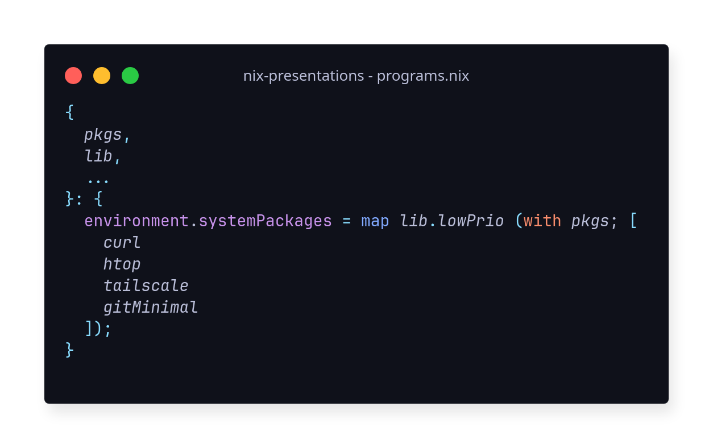

<!-- footer: ❄️ -->

# Nix

A cross-platform **package manager** for Unix-like systems, invented in 2003 by Eelco Dolstra. _[Wikipedia](https://en.wikipedia.org/wiki/Nix_(package_manager)s)_

Nix is a tool that takes a unique approach to package management and system configuration. Learn how to make **reproducible**, **declarative** and **reliable systems**. _[Official site](https://nixos.org/)_

---

## The nix rabbit hole

but, nix is also:
- an os _(more on this later)_
- a programming language _(more on this later too)_
- a build tool
- and other things, that I don't even know yet 😮‍💨

---
<!-- footer: ❄️❄️ -->

# So, why Nix ?

I think that Nix is appealing for two main reasons:

1. Reproducibility
2. Multiple package versions
...
- Easy Rollback
- Seamless integration with other tools

> Take [this pill](https://nixos.org/guides/nix-pills/01-why-you-should-give-it-a-try)! 💊😉

---

## 1. Because it's **reproducible**.

This is the most obvious benefit, as it is the whole motivation behind Nix. 
Two people building the same package will always get the same output, if you’re careful enough with pinning the versions of inputs in place.
And even if some input is different, it will be very clear since the store path will change.

> 💡Think of it as a pure function.

---

## 2. **Multiple versions of any package** can be installed simultaneously
Every package is installed under its own prefix, so there are no collisions (unless a given package depends on multiple versions of another package, which is a rare occasion and is usually easy enough to handle).
This can be really handy during development – no more `nvm`, `volta`, ...

---
<!-- footer: ❄️❄️❄️ -->

# How to Nix ?

Yes, demo time! 🎉. We're gonna see how to use:

1. nix as package manager _(project level)_
    - To install packages, and make a reproducible dev environment

2. nix/nixos to configure your system in a rebroducible way. _(system level, so, as a server)_

---

**Installing nix**:

- [Official way](https://nixos.org/download/)
- [An more clean way](https://github.com/DeterminateSystems/nix-installer)
    More friendly than the official one.

---

<!-- footer: ❄️❄️❄️❄️ -->

# END OF THE SLIDES

Time for real example

